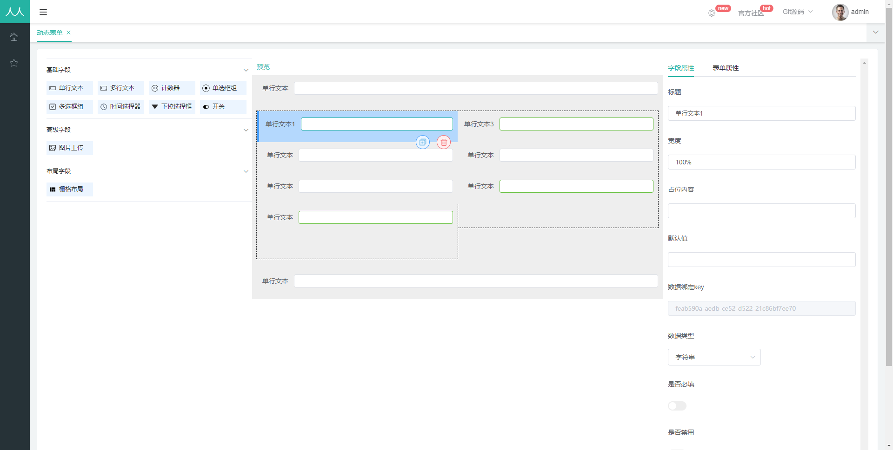

## form-design
- form-design本人基于vue、element-ui，vuedraggable构建开发，实现用拖拉拽和自主配置来实现动态表单设计功能功能，提供一套更优的前端解决方案
- 支持拖拉拽控件，支持二次拖来拽
- 支持自定义配置和栅格布局
- 支持表单验证和表单预览
- 前后端分离，通过token进行数据交互，可独立部署

- (账号密码：admin/admin)

