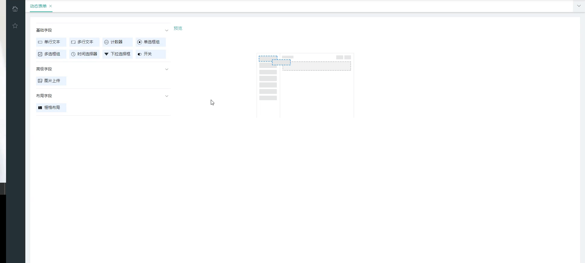
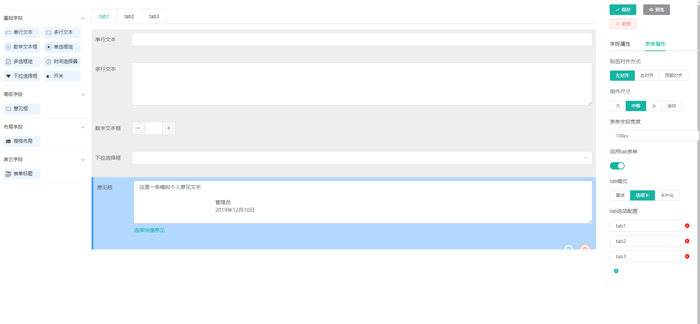

<!--
 * @Author: your name
 * @Date: 2019-12-10 10:46:21
 * @LastEditTime: 2019-12-10 11:55:18
 * @LastEditors: your name
 * @Description: In User Settings Edit
 * @FilePath: \form-design\README.md
 -->
## form-design (react版本，手机版本请查看我的<a target="_blank" href="https://github.com/TsangTszKin/react-form-design">react-form-design</a>)
- form-design本人基于vue、element-ui，vuedraggable构建开发，实现用拖拉拽和自主配置来实现动态表单设计功能功能，提供一套更优的前端解决方案
- 自主研发，模仿小幺鸡表单设计器（<a target="_blank" href="http://tools.xiaoyaoji.cn/form/#/">点击查看小幺鸡</a>）
- 支持拖拉拽控件，支持二次拖来拽
- 支持自定义配置和栅格布局
- 支持表单验证和表单预览
- 前后端分离，通过token进行数据交互，可独立部署

- (账号密码：admin/admin)

----------

### 12.10更新
- 表单设置页面设置为全屏显示
- 新增tab页的表单模式，可自定义
- "计数器元素" 改为 "数字文本框"
- 新增元素 '意见框'，提供快捷选择意见和落款
- 大大加强组件化封装
- icon改为iconfont集成

